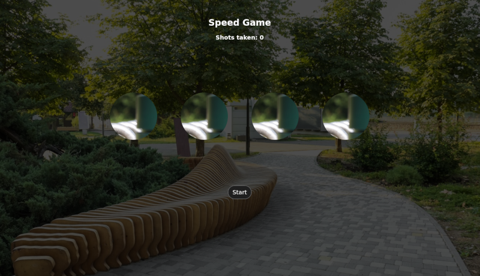

# Shutter speed game
- The game simulates a camera shutter speed

## Goal
- Point is awarded to the user each time the right circle with the squirrel image is clicked.
- Your goal is to take as many shots as you can.
- The speed increases after each click.

## How the game ends
- Game ends if the player clicks the wrong circle.
- Game ends if the player fails to click more tha three times.
- Player can click the end button to end the game.

### Screenshot

Live url: [speedgame](https://stacknatic.github.io/speedgame/)
